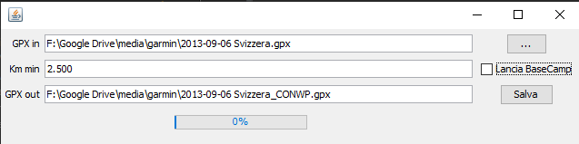

## scopi
Quando si disegnano lunghe rotte su Garmin Basecamp con pochi waypoint ciò che si vede in Basecamp
potrebbe differire da quello che vedi nel navigatore (io ho uno Zumo 595).
Per limitare il ricalcolo dei percorsi e delle strade scelte dal mio Garmin Zumo 595 Ho aggiunto (ogni 2000 m oppure qualunque cosa tu decida) nuovi waypoint intermedi su di un File *.gpx esportato.

Il nuovo file gpx avrà un'estensione di "_CONWP.gpx"
## Pacchetto
Puoi impacchettare un jar con tutte le dipendenze con il comando:

	mvn clean package -P remote

questo creerà sotto la directory `/target/` un file `gpxparse-jar-with-dependencies.jar`
	
## file di proprietà
questa app utilizza il file di proprietà `GpxParse.properties` che contiene alcune chiavi importanti ma anche
chiave `lastDirGpx` che è l'ultimo file (anche dir) aperto

## Lancio
Il file `gpxparse-jar-with-dependencies.jar` che può essere lanciato (sotto la directory del progetto) con il comando:

	java -jar target/gpxparse-jar-with-dependencies.jar
	
oppure col cmd `lancia.cmd`

se tutto funziona correttamente dovrebbe comparire la seguente form:

dove:

- **GPX in** è il file da dare in pasto al programma
- **Km min** è la distanza che voglio fare intercorrere fra i WayPoint
- **GPX out** è il file che verrà generato
- il Check "**Lancia BaseCamp**" permette di visualizzare, dopo la preparazione, il nuovo percorso, purchè sia correttamente installato e registrato Garmin BaseCamp

